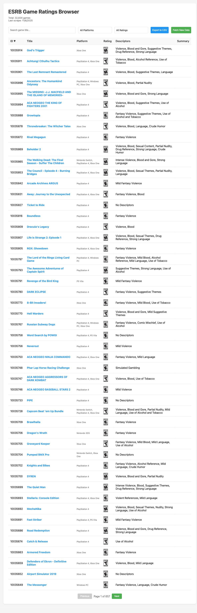
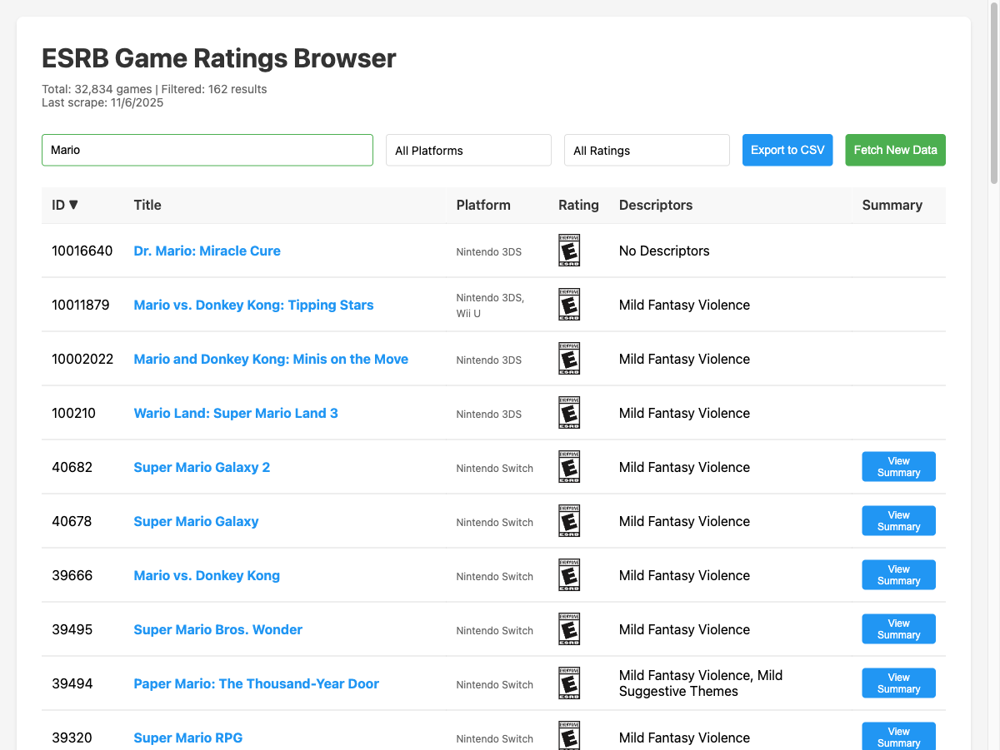
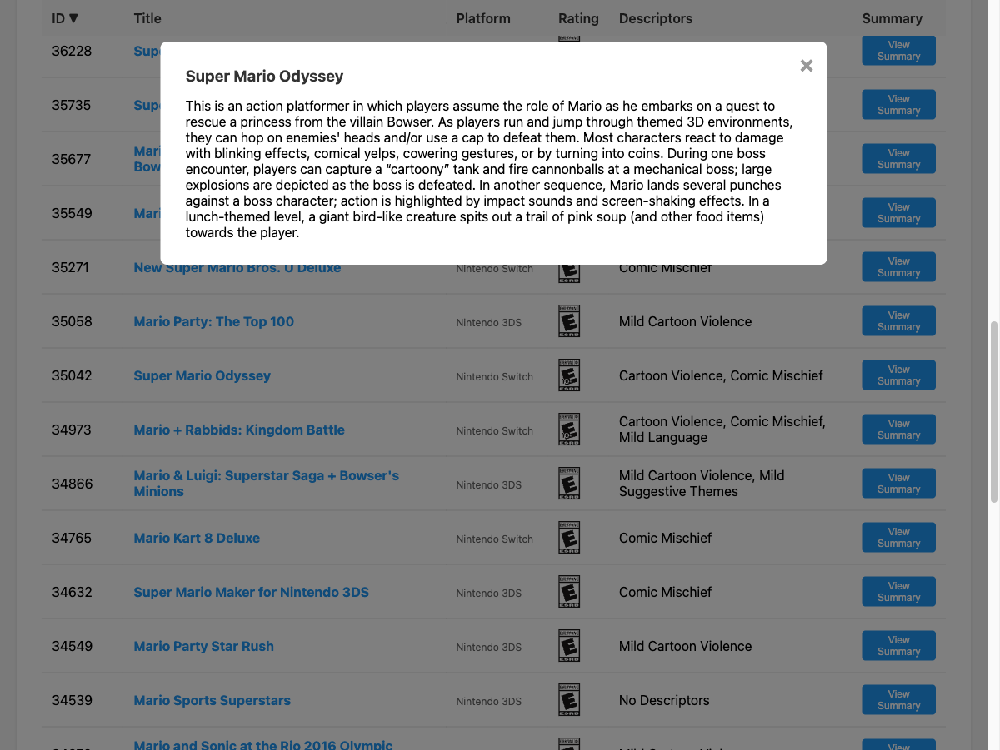

# ESRB Game Ratings Browser

A lightweight web app to browse, search, and export the ESRB video game ratings database. Built with Flask, SQLite, and vanilla JavaScript — no frameworks, no build tools, no bloat.



## Features

- **Browse 32,800+ ESRB-rated games** across 900+ platform combinations
- **Search by title** with instant results
- **Multi-select filters** for platforms and ratings
- **Sortable columns** — click ID, Title, Platform, or Rating headers (defaults to newest first)
- **Pagination** — 50 games per page with 657+ pages of data
- **Export to CSV** — respects all active filters and search terms
- **Game summaries** — view ESRB rating summaries in a modal popup
- **Official ESRB rating icons** (E, E10+, T, M, AO) loaded from ESRB CDN
- **Clickable game titles** linking directly to ESRB rating pages
- **Incremental scraper** — fetches only new ratings from ESRB.org, stops when it hits existing data

## Screenshots

### Search & Filter

Search by game title with instant filtering. The header shows the filtered count alongside the total.



### Rating Summary Modal

Click "View Summary" to read the full ESRB rating summary for any game.



## Rating Distribution

| Rating | Count | Description |
|--------|------:|-------------|
| E      | 16,521 | Everyone |
| T      | 8,568  | Teen |
| E10+   | 4,096  | Everyone 10+ |
| M      | 3,622  | Mature 17+ |
| AO     | 27     | Adults Only 18+ |

## Quick Start

```bash
# Clone the repo
git clone https://github.com/your-username/esrb-tool-v2.git
cd esrb-tool-v2

# Install dependencies
pip install -r requirements.txt

# Import initial data (if CSV is present)
python import_csv.py

# Run the app
python app.py
```

Visit http://localhost:5763

## Updating Ratings

Click **"Fetch New Data"** in the web UI, or run the scraper directly:

```bash
python scrape.py
```

The scraper fetches the latest ratings from [ESRB.org](https://www.esrb.org/search/?searchType=LatestRatings) and stops automatically when it encounters a game already in the database.

## Project Structure

```
esrb-tool-v2/
├── app.py               # Flask backend (~220 lines)
├── scrape.py            # ESRB.org scraper (~195 lines)
├── import_csv.py        # One-time CSV import script
├── templates/
│   └── index.html       # Frontend — single file, vanilla JS (~640 lines)
├── esrb_ratings.db      # SQLite database (auto-generated)
├── requirements.txt     # Flask, requests, beautifulsoup4
└── screenshots/         # App screenshots
```

## API Endpoints

| Method | Endpoint | Description |
|--------|----------|-------------|
| GET | `/` | Main web UI |
| GET | `/api/ratings` | Paginated ratings with search, filter, sort |
| GET | `/api/stats` | Database statistics (totals, platforms, ratings) |
| GET | `/api/export` | Export filtered data as CSV download |
| POST | `/api/fetch-new-data` | Trigger the scraper to fetch new ratings |

### Example: Query ratings

```
GET /api/ratings?search=Mario&page=1&per_page=50&sort=game_id&dir=desc
```

Returns JSON:
```json
{
  "data": [
    {
      "game_id": 40682,
      "game_title": "Super Mario Galaxy 2",
      "platform": "Nintendo Switch",
      "rating": "E",
      "descriptors": "Mild Fantasy Violence",
      "url": "https://www.esrb.org/ratings/40682/super-mario-galaxy-2/",
      "summary": "...",
      "created_at": "2025-11-05 20:26:37"
    }
  ],
  "total": 162,
  "page": 1,
  "per_page": 50,
  "total_pages": 4
}
```

## Tech Stack

- **Backend:** Flask + SQLite (raw SQL, no ORM)
- **Frontend:** Vanilla JavaScript + CSS (no frameworks, no build step)
- **Scraper:** requests + BeautifulSoup
- **Database:** SQLite with indexes on rating, title, and platform

## Dependencies

```
Flask==3.0.0
requests==2.31.0
beautifulsoup4==4.12.3
```

That's it. Three packages.

## License

MIT
